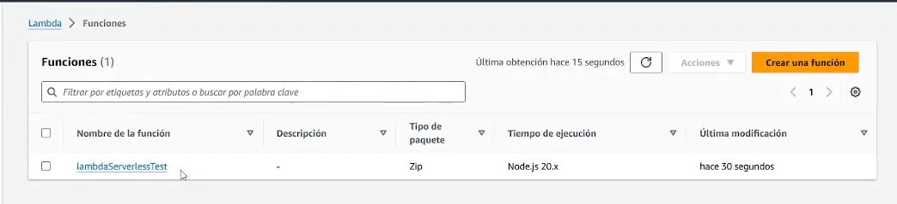

<div align="center">

<div align="right">


</div>
</div>

<br>

<br>

<div align="right">
  <a href="../../../README.md" title="Español">
    
  </a>
  <a href="./README.en.md" title="Inglés">
    
  </a>
</div>

<br>

<div align="center">

# Lambda Serverless AWS 

</div>

A Lambda function to publish with Serverless, without building the infrastructure by hand. It brings together the Serverless Framework, Node.js 20, and automatic deploys with GitHub Actions, so a push to master puts the Lambda function in us-east-2, the path from the repository to the cloud is already solved, and you can reuse the same flow in your own services.

<div align="left">
<a href="https://www.youtube.com/playlist?list=PLCl11UFjHurBhSQCwGDw7uDd2yAu5tVsV" title="Playlist"></a>
</div>

<br>

## Index 📜

<details>
 <summary>View details</summary>

<div align="right">

`Last update: 27/09/26`

</div>

### Section 1) Description, setup, and technologies.

* [1.0) Description.](#10-description-)
* [1.1) Running the project.](#11-running-the-project-)
* [1.2) Technologies.](#12-technologies-)

### Section 2) Documentation and references.

* [2.0) Documentation and references.](#20-documentation-and-references-)

</details>

<br>

## Section 1) Description, setup, and technologies.

### 1.0) Description [🔝](#index-)

<details>
 <summary>View details</summary>

* The service is defined in `serverless.yml`: one Lambda function (`lambdaServerlessTest`) on the Node.js 20 runtime, with 512 MB of memory and a 10-second timeout, in `us-east-2`.
* The handler lives in `src/index.js`. It is the sample that receives the event and writes an array of numbers to the log.
* Deploy runs on its own. On every push to `master`, the workflow `.github/workflows/master.yml` installs Node.js 20 and publishes the function with the Serverless Framework.

</details>

### 1.1) Running the project [🔝](#index-)

<details>
 <summary>View details</summary>

* Clone the repository and open the folder.

```bash
git clone https://github.com/andresWeitzel/Lambda_Serverless_AWS_Example.git
cd Lambda_Serverless_AWS_Example
```

* Node.js 20 is required. It is the same runtime the function uses.
* The project does not declare application dependencies. The lockfile is empty, and `npm ci` leaves the environment ready for the workflow.
* Deploy is not done from the AWS console. A push to `master` makes GitHub Actions run `serverless deploy` with `serverless/github-action@v3.2`.
* The workflow reads credentials from the repository secrets: `AWS_ACCESS_KEY_ID` and `AWS_SECRET_ACCESS_KEY`.

</details>

### 1.2) Technologies [🔝](#index-)

<details>
 <summary>View details</summary>

| **Technology** | **Version** | **Use** |
| --- | --- | --- |
| [Node.js](https://nodejs.org/) | 20.x | Function runtime |
| [AWS Lambda](https://docs.aws.amazon.com/lambda/latest/dg/welcome.html) | — | Execution in `us-east-2` |
| [Serverless Framework](https://www.serverless.com/framework/docs) | GitHub Action 3.2 | Service definition and deploy |
| [GitHub Actions](https://docs.github.com/actions) | — | Publish on every push to `master` |
| [Git](https://git-scm.com/) | — | Version control |

</details>

<br>

## Section 2) Documentation and references.

### 2.0) Documentation and references [🔝](#index-)

<details>
 <summary>View details</summary>

#### AWS

* [AWS Lambda documentation](https://docs.aws.amazon.com/lambda/latest/dg/welcome.html)
* [AWS Lambda with Node.js](https://docs.aws.amazon.com/lambda/latest/dg/lambda-nodejs.html)

#### Serverless Framework

* [Framework documentation](https://www.serverless.com/framework/docs)
* [Serverless AWS guide](https://www.serverless.com/framework/docs/providers/aws/guide/intro)
* [Serverless GitHub Action](https://github.com/serverless/github-action)

#### Repository and CI

* [GitHub Actions documentation](https://docs.github.com/actions)
* [Node.js 20 documentation](https://nodejs.org/docs/latest-v20.x/api/)
* [Git documentation](https://git-scm.com/doc)

#### Learning

* [AWS Serverless playlist](https://www.youtube.com/playlist?list=PLCl11UFjHurBhSQCwGDw7uDd2yAu5tVsV)

</details>
